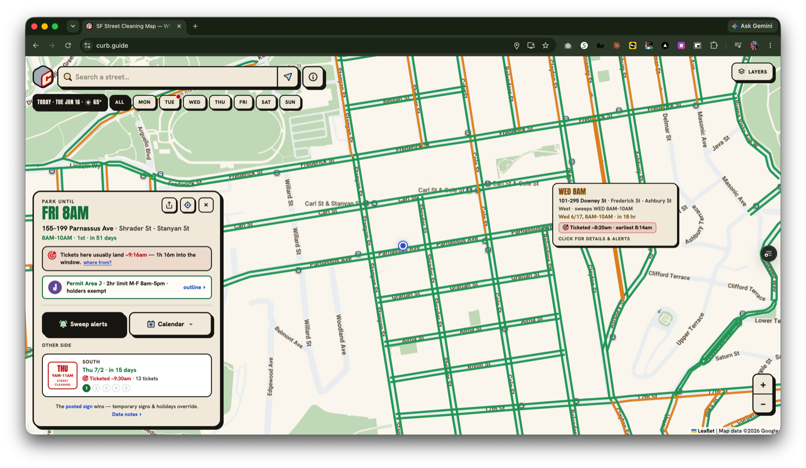

# CURB

**Know where to park in SF.** Live at **[curb.guide](https://curb.guide)**.

[](LICENSE)
[](https://curb.guide)
[](https://data.sfgov.org)



San Francisco posts a 2-hour street-cleaning window. We matched **about a million real
citations** (~815,000 to their exact blocks): on the median block, the tickets land inside a
**~20-minute span**. CURB puts that on a map — every curb in SF colored by its next
sweep, with the posted schedule AND the times tickets are actually written there,
plus permit (RPP) areas, meters, loading zones (including the unmetered white school
zones the city doesn't publish on DataSF), and one-tap Web Push move-your-car alerts.

The whole app is **one static `index.html`** — vanilla JS + Leaflet, no framework, no
build step — plus a few Vercel serverless functions for push and share pages, and
precomputed JSON data assets rebuilt by `scripts/build-*.mjs`. Everything runs on
free tiers. Free, no accounts, no ads, no cookies.

Read the data story: **[curb.guide/tickets](https://curb.guide/tickets)** · How it
works: **[curb.guide/about](https://curb.guide/about)** · Contributions welcome —
see [CONTRIBUTING.md](CONTRIBUTING.md) · Security: [SECURITY.md](SECURITY.md)

## Run locally
```bash
npm install            # for the web-push dep used by the API
npm run dev            # = npx serve . -l 3000  (http://localhost:3000)
```
Open http://localhost:3000. A localhost origin is needed for geolocation + service worker.

## Deploy
```bash
npm run deploy         # = vercel
```

## Push notifications (wired end-to-end)
The "🔔 Sweep alerts" button in the detail sheet subscribes the device to Web Push and
saves its spot; a Vercel cron pushes "move your car" ~30 min before the next sweep.

Setup (one time):
1. **VAPID keys** — `npx web-push generate-vapid-keys`. The public key is embedded in
   `index.html` (`VAPID_PUBLIC_KEY`); both keys go in env (see `.env.example`). If you
   rotate keys, update the constant in `index.html` too.
2. **Subscription store** — add the **Upstash for Redis** integration on Vercel (Storage
   tab). It sets `KV_REST_API_URL` / `KV_REST_API_TOKEN` automatically. `api/_store.js`
   also accepts `UPSTASH_REDIS_REST_URL` / `_TOKEN` for a standalone Upstash DB.
3. **Env vars on Vercel** — `VAPID_PUBLIC_KEY`, `VAPID_PRIVATE_KEY`, `VAPID_SUBJECT`,
   `CRON_SECRET` (required — the cron refuses to run without it), plus the KV vars from step 2.
4. **Cron** — `vercel.json` runs `/api/send-notifications` every 15 min. **Note:** the
   15-min cadence needs **Vercel Pro**; on Hobby, Vercel throttles crons to ~once/day. As a
   fallback, point any external scheduler (e.g. cron-job.org) at the endpoint with header
   `Authorization: Bearer <CRON_SECRET>`.

iOS — two paths:
- **Native app** (the iOS build is a WKWebView wrapper with native **APNs**): the "🔔 Sweep
  alerts" button is diverted to the native bridge, so no Home-Screen install is needed. Set
  `APNS_KEY_P8_B64` (or `APNS_KEY_P8`), `APNS_KEY_ID`, `APNS_TEAM_ID`, `APNS_BUNDLE_ID` on Vercel
  (see `.env.example` / `docs/native-push-plan.md`).
- **Mobile Safari (PWA)**: Web Push only works once CURB is installed to the Home Screen (the app
  shows an "Add to Home Screen" hint for un-installed iPhones).

## Map basemap (Google Maps, optional)
With a Google **Map Tiles API** key the basemap uses official Google tiles; without one it
falls back to keyless CARTO Voyager. The key is a *client* key — **restrict it by HTTP referrer
+ API** in Google Cloud Console (add `http://localhost:3000/*`, `https://*.vercel.app/*`, and
your domain).

The key is kept out of this public repo:
- **Local:** copy `config.example.js` → `config.js` (gitignored) and paste your key.
- **Deployed:** set `GMAPS_KEY` in your Vercel env. `api/config.js` serves it to the client and
  `vercel.json` rewrites `/config.js` → `/api/config`, so nothing changes in `index.html`.

## Data
- Street sweeping: DataSF `yhqp-riqs`
- Parking meters: DataSF `8vzz-qzz9`
- Parking regulations / RPP: DataSF `hi6h-neyh` (2017 set; may be incomplete)
- Address search + block ranges: DataSF `3mea-di5p` (Enterprise Addressing System, nightly)
- Loading / color-curb zones: DataSF `6cqg-dxku` (Meter Operating Schedules) ⋈ meters
- Unmetered white zones (passenger loading, school zones): SFMTA Digital Curb on the
  city ArcGIS hub — snapshot via `npm run build:whitezones` (data DataSF excludes)
- Enforcement history: DataSF `ab4h-6ztd` (parking citations) — precomputed into
  `data/enforcement.json` by `npm run build:enforcement` (see `scripts/build-enforcement.mjs`)
- /tickets aggregates: `npm run build:stats` → `data/stats.json` (yearly fines,
  violations, hour histograms, neighborhood totals + five-year surge)
- Neighborhood boundaries: DataSF `j2bu-swwd` (Analysis Neighborhoods) — /tickets + the per-hood pages

All DataSF datasets are published under the Open Data Commons PDDL; the code here is
MIT (see [LICENSE](LICENSE)).

The posted street sign is always the source of truth. "Ticketed ~" times are historical
guidance from past citations, not a guarantee. There is no live space-availability data
for SF (SFpark sensors retired in 2014).

See `CLAUDE.md` for architecture and data schemas, `docs/` for the sweeper-data research
and ready-to-send public-records requests.

## How the ticket times are reconstructed

The headline finding — *"the median block is ticketed within ~20 minutes"* — is built offline by
`scripts/build-enforcement-records.py` + `scripts/build-stats.mjs`:

1. **Pull the citations.** The 2024–2026 street-cleaning citations came via SFMTA public-records request
   **#26-5453** — about a million rows, **with GPS coordinates** restored (the public DataSF feed
   `ab4h-6ztd` has dropped coordinates since ~2021). The older address-only path — normalize to
   `stripZeros(number)|UPPERCASE(street)` and join to a block (CNN) via the Enterprise Addressing System
   `3mea-di5p`, in `scripts/build-enforcement.mjs` — survives only as a pre-2024 fallback.
2. **Match by GPS, not address strings.** Each citation's GPS point is matched to the nearest street
   segment (CNN) within ≤40 m (`yhqp-riqs` geometry), recovering **~815,000 of ~1,000,000** tickets — far
   more, and more accurately, than the lossy address join.
3. **Reduce to a per-block-side distribution.** `data/enforcement.json` stores, per block side,
   `[count, mean-minutes-into-window, earliest, latest]`. The window is really **~20 minutes** — the median
   ticket lands ~25 min in, and **~77% of tickets fall within the first 45 minutes (~90% within the first
   hour)**. A companion dataset — the city's actual **sweeper GPS** (request **#26-5451** → `data/sweeps.json`
   via `scripts/build-sweeps.py`) — shows tickets land a median of **~19 minutes after** the sweeper passes.

**Known limits (also stated on the About page):** it's an address-string→block join, not GPS, so any
single block can be off; the distribution is conditional on enforcement happening — it shows *when*
tickets land, not *whether* a block is swept (survivorship); data is refreshed monthly; and it's
predictive from history, never live (SF publishes no real-time sweeper GPS). The posted sign is always
the source of truth.

The inferred truck-route layer is a **Beta estimate**: blocks sharing a corridor + sweep window are
ordered by their mean ticket time; runs whose time-vs-position correlation is weak (`|r| < 0.35`) are
not drawn.

## Regenerating derived assets
```bash
npm run og                  # rebuild og.png (1200x630 social card) from og/template.html
npm run build:enforcement   # rebuild data/enforcement.json from ~2yr of citations (~2 min)
```
